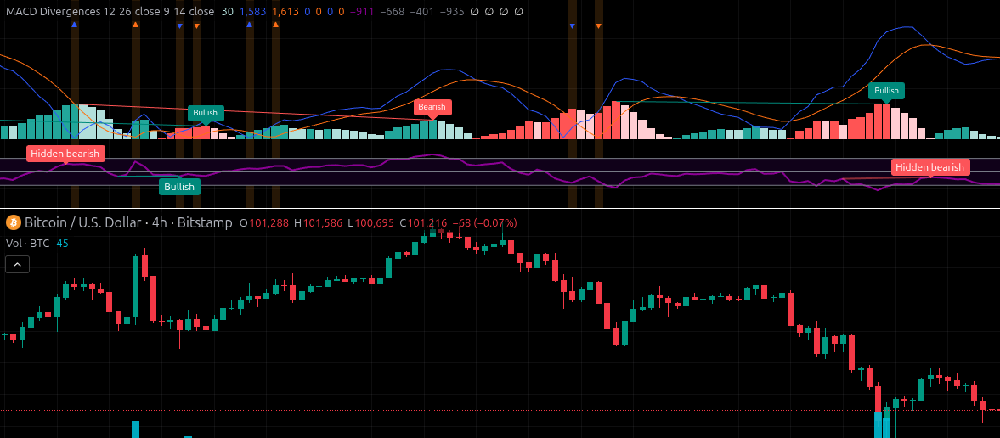

# MACD+RSI-Indicator

A single TradingView indicator that combines both the **MACD** (Moving Average Convergence Divergence) and the **RSI** (Relative Strength Index).

## Why?

The free TradingView (Basic) plan allows a maximum of **3 indicators** on a single chart. Normally, using RSI and MACD would take up two of those three valuable slots.

This script combines them into **one single indicator**, freeing up a slot. This allows you to add other technical indicators (like Moving Averages, Volume, or Bollinger Bands) and maximize the potential of the free plan.

## Preview

``

## How to Use
### [Direct link](https://www.tradingview.com/script/CmrkjfaP-MACD-Divergences-RSI/)

### Manual mode:
1.  Open your desired chart on [TradingView](https://www.tradingview.com/).
2.  Click the **"Pine Editor"** tab at the bottom of the screen.
3.  Copy the code from the `.pine` file in this repository.
4.  Paste the code into the Pine Editor.
5.  Click **"Add to chart"** (Añadir al gráfico).

## Settings

The indicator's inputs are fully configurable, just like the original, separate indicators. You can adjust:
* RSI Length and Source
* MACD Fast Length, Slow Length, and Signal Smoothing

## PineScript Version

This indicator is written in **PineScript v5**.

## License

GNU GPL v3 license - The code and content in this repository are licensed under the GNU GPL v3 license. See the `LICENSE` file for more information.
